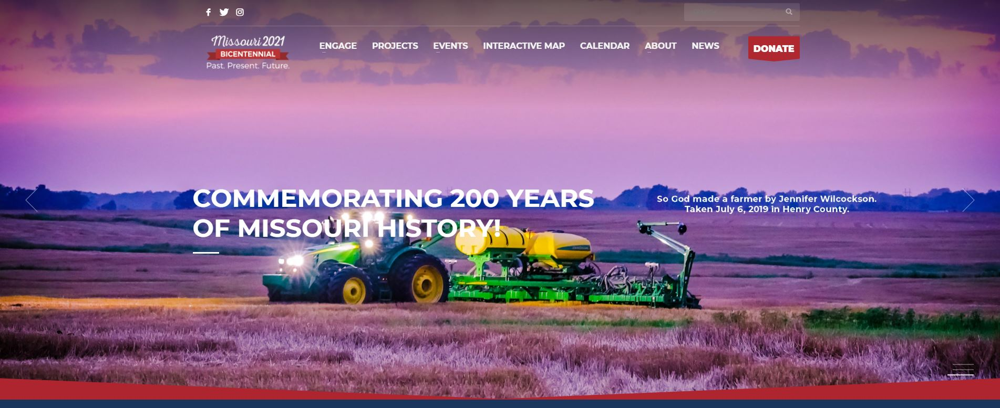

# Missouri Bicentennial Event
### This is the event that I am working for my capstone project.

[Missouri2021](https://missouri2021.org/)
### **Missorui 2021 Bicentennial Event**
>August 10, 2021, will mark the two hundredth anniversary of Missouri’s entry as the 24th state to enter the United States. A state with many different regional cultures, geographies, and industries, each Missouri community, county, and region has a story to tell about its people, their history, their commerce, and their culture. By celebrating the accomplishments and diversity of all these regions, we help create a better understanding of our one Missouri and the ties that bind us together.Under the Missouri 2021 banner, the State Historical Society of Missouri is committed to coordinating a truly statewide commemoration that incorporates both rural and urban communities in projects, programs, and events that contribute to a better shared understanding of the State’s geographic and cultural diversity as well as the similarities that bring us together as Missourians.This important work began in 2013 when the 97th Missouri General Assembly, issued House Concurrent Resolution 7 (HCR7) tasking SHSMO to develop “plans, ideas, and proposals to commemorate and celebrate” the Missouri Bicentennial and to provide “guidance and direction to a statewide effort to promote and celebrate the State of Missouri’s rich and complex history.”This role is fitting for the State Historical Society of Missouri, a trustee of the State of Missouri since 1899, as the organization’s mission is to collect, preserve, publish, exhibit, and make available material related to all aspects and periods of Missouri history. The Society also seeks to generate interest in and appreciation of the rich cultural heritage of the state and its people through education and outreach.

I am working as one of crew in *Tiger Support* team which is a team built for making animations for the event.
[Go Back to Homepage](https://github.com/jjthd/JjthdMarkdownPage/blob/main/README.md)

